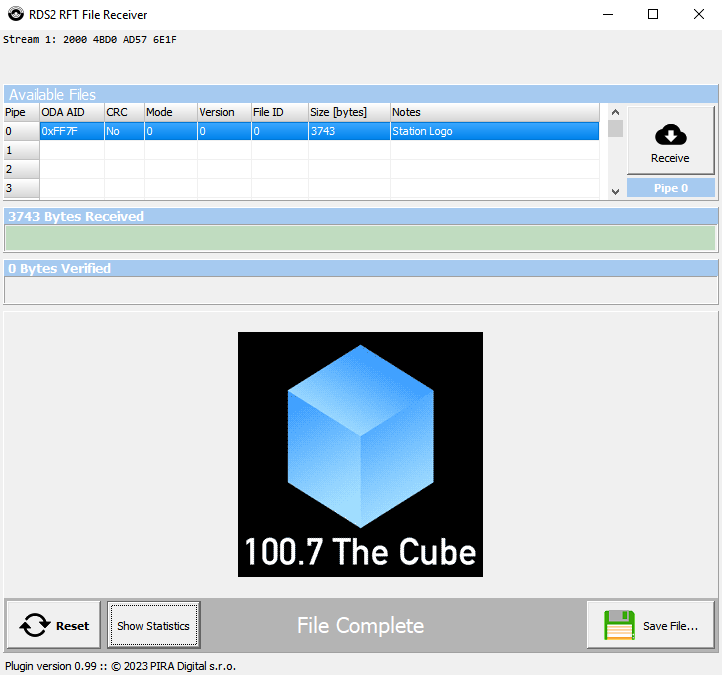

# MiniRDS

### This is the world's first open-source RDS2 encoder!

This program is designed for generating a realtime RDS signal. It is capable of RDS2 using up to 3 additional subcarriers.

This is based on the RDS encoder from [Mpxgen](https://github.com/Anthony96922/mpxgen), which is currently not maintained.


This software is currently used as the RDS encoder for KPSK in Los Angeles, CA, USA.

#### Features
- Low resource requirements
- Support for basic RDS data fields: PS, RT, PTY and AF
- RDS items can be updated through control pipe
- RT+ support
- RDS2 support (including station logo transmission)

#### To do
- Threading

#### Planned features
- UECP
- Configuration file

RDS2 image reception in action: https://www.bitchute.com/video/sNXyTCCAYA8l/

## Build
For Debian-like distros: `sudo apt-get install libao-dev libsamplerate0-dev` to install deps.

Once those are installed, run
```sh
git clone https://github.com/Anthony96922/MiniRDS
cd MiniRDS/src
make
```

## How to use
Simply run:
```
./minirds
```
to confirm proper operation.

Please see `-h` for more options.

### Stereo Tool integration
The following setup allows MiniRDS to be used alongside Stereo Tool audio processor.
```
.-------------.
| Stereo Tool |--(FM MPX w/o RDS)-----.
'-------------'                       |
                                      v
                           .-----------------------.
                           |       ALSA dmixer     |
                           | slave: MPX sound card |--------(to sound card)-------->
                           |        192 kHz        |
                           '-----------------------'
                                      ^
.---------.                           |
| MiniRDS |--(RDS output)-------------'
'---------'
```

First, add the following contents to ~/.asoundrc:
```
# ST MPX output
pcm.mpxmix {
  type dmix
  ipc_key 1001
  slave {
    pcm "digital-out" # change to your actual sound card
    rate 192000
  }
}
```

Next, add the collowing contents to ~/.ao:
```
dev=mpxmix
```

Then set the Stereo Tool MPX output to use the ALSA "mpxmix" output. Finally run minirds. *Adjust volumes accordingly.*

Note that this setup is not optimal. Hans plans to add RDS2 passthough to the ST external RDS input. [Stereo Tool forum post](https://forums.stereotool.com/viewtopic.php?f=14&t=33793&start=150)

### Changing PS, RT, TA and PTY at run-time
You can control PS, RT, TA (Traffic Announcement flag), PTY (Program Type) and many other items at run-time using a named pipe (FIFO). For this run MiniRDS with the `--ctl` argument.

Scripts can be written to obtain and send "now playing" text data to MiniRDS for dynamic RDS.

See the [command list](doc/command_list.md) for a complete list of valid commands.

### RDS2
MiniRDS has a working implementation of the RFT protocol in RDS2. Please edit the Makefile accordingly and rebuild for RDS2 capabilities. You may use your own image by using the provided "make-station-logo.sh" script. Valid formats are PNG or JPG and should be about 3kB or less. Larger images take considerably longer to receive.



## References
- [EN 50067, Specification of the radio data system (RDS) for VHF/FM sound broadcasting in the frequency range 87.5 to 108.0 MHz](http://www.interactive-radio-system.com/docs/EN50067_RDS_Standard.pdf)
- [IEC 62106-2, Radio data system (RDS) – Part 2: Message format: coding and definitions of RDS features](http://downloads.dxing.si/download.php?file=ISO%20Stamdards/RDS/latest%20(includes%20RDS2)/iec-62106-2-2021.pdf)
- [IEC 62106-3, Radio data system (RDS) – Part 3: Usage and registration of Open Data Applications (ODAs)](http://downloads.dxing.si/download.php?file=ISO%20Stamdards/RDS/latest%20(includes%20RDS2)/iec-62106-3-2018.pdf)
- [IEC 62106-4, Radio data system (RDS) – Part 4: Registered code tables](http://downloads.dxing.si/download.php?file=ISO%20Stamdards/RDS/latest%20(includes%20RDS2)/iec-62106-4-2018.pdf)
- [IEC 62106-6, Radio data system (RDS) – Part 6: Compilation of technical specifications for Open Data Applications in the
public domain](http://downloads.dxing.si/download.php?file=ISO%20Stamdards/RDS/latest%20(includes%20RDS2)/iec-62106-6-2018.pdf)
- [P232 RDS Encoder
Technical Manual](https://pira.cz/rds/p232man.pdf)

## Credits
The RDS waveform generator was adapted from [PiFmRds](https://github.com/ChristopheJacquet/PiFmRds)
