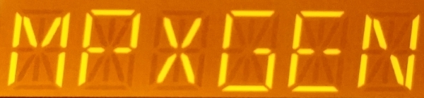

# MiniRDS

### This is the world's first open-source RDS2 encoder!

This program is designed for generating a realtime RDS signal. It is capable of RDS2 using up to 3 additional subcarriers.

This is based on the RDS encoder from [Mpxgen](https://github.com/Anthony96922/mpxgen), which is currently not maintained.



This software is currently used as the RDS encoder for KPSK in Los Angeles, CA, USA.

#### Features
- Low resource requirements
- Support for basic RDS data fields: PS, RT, PTY and AF
- RDS items can be updated through control pipe
- RT+ support
- Preliminary untested RDS2 support (including station logo transmission)

#### To do
- Threading

#### Planned features
- UECP
- Configuration file

The RDS encoder in action: https://www.youtube.com/watch?v=ORAMpYhDcVY

## Build
This app depends on libao and libsamplerate. On Ubuntu-like distros, use `sudo apt-get install libao-dev libsamplerate0-dev` to install them.

Once those are installed, run
```sh
git clone https://github.com/Anthony96922/MiniRDS
cd MiniRDS/src
make
```

To update, just run `git pull` then run `make`.

## How to use
Before running, make sure you're in the audio group to access the sound card.

Simply run:
```
./minirds
```
RDS will be running at 4.5% injection. Connect the output to the SCA input of your transmitter. If using Stereo Tool for audio processing and stereo encoding, enable and use the "Use SCA Input as external RDS input" option instead. Tune an RDS-enabled radio to your transmitter's frequency. You should see "MiniRDS" appear on the display. Your transmitter must be able to take higher frequencies for RDS to work correctly.

Please see `-h` for more options.

### Changing PS, RT, TA and PTY at run-time
You can control PS, RT, TA (Traffic Announcement flag), PTY (Program Type) and many other items at run-time using a named pipe (FIFO). For this run MiniRDS with the `--ctl` argument.

Scripts can be written to obtain and send "now playing" text data to MiniRDS for dynamic RDS.

See the [command list](doc/command_list.md) for a complete list of valid commands.

### RDS2 (WIP)
MiniRDS has an untested implementation of the RFT protocol in RDS2. Please edit the Makefile accordingly and run `make clean && make` to rebuild with RDS2 capabilities. You may use your own image by using the provided "make-station-logo.sh" script. Those with RDS2 capable hardware are encouraged to test this feature and report back any issues!

## References
- [EN 50067, Specification of the radio data system (RDS) for VHF/FM sound broadcasting in the frequency range 87.5 to 108.0 MHz](http://www.interactive-radio-system.com/docs/EN50067_RDS_Standard.pdf)
- [IEC 62106-2, Radio data system (RDS) – Part 2: Message format: coding and definitions of RDS features](http://downloads.dxing.si/download.php?file=ISO%20Stamdards/RDS/latest%20(includes%20RDS2)/iec-62106-2-2021.pdf)
- [IEC 62106-3, Radio data system (RDS) – Part 3: Usage and registration of Open Data Applications (ODAs)](http://downloads.dxing.si/download.php?file=ISO%20Stamdards/RDS/latest%20(includes%20RDS2)/iec-62106-3-2018.pdf)
- [IEC 62106-4, Radio data system (RDS) – Part 4: Registered code tables](http://downloads.dxing.si/download.php?file=ISO%20Stamdards/RDS/latest%20(includes%20RDS2)/iec-62106-4-2018.pdf)
- [IEC 62106-6, Radio data system (RDS) – Part 6: Compilation of technical specifications for Open Data Applications in the
public domain](http://downloads.dxing.si/download.php?file=ISO%20Stamdards/RDS/latest%20(includes%20RDS2)/iec-62106-6-2018.pdf)

## Credits
The RDS waveform generator was adapted from [PiFmRds](https://github.com/ChristopheJacquet/PiFmRds)
The CT generator was adapted from [PiFmAdv (https://github.com/miegl/PiFmAdv)
